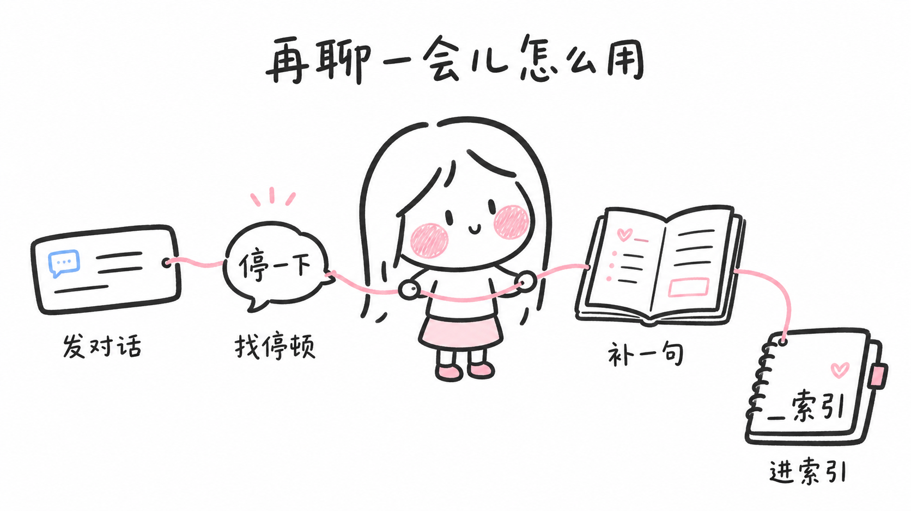

# Talk a Little Bit More（再聊一会儿）Skill

一个用来复盘对话的 skill。

Skill 名称：`talk-a-little-bit-more`



它会帮你找出那些“其实还可以再停一下”的时刻：哪里有话没说完，哪里你接偏了，哪里如果多问一句，对话可能就会往下走。

这个公开版保留了原本的复盘结构和首次使用引导，但去掉了作者自用的本地路径、私人笔记规则和真实对话材料。

---

## 你可以怎么叫它

你不需要记命令，直接这样说就行：

- 我想试试「再聊一会儿」这个 skill
- 我想试试 `talk-a-little-bit-more`
- 帮我复盘这段对话
- 我刚聊完一个人，感觉没聊透，帮我看看
- 这段对话里有没有本可以再聊一会儿的地方
- 我是不是漏接了什么
- 如果下次再遇到类似的人，我可以怎么聊得更舒服一点

---

## 首次使用时会发生什么

第一次启动这个 skill 时，它会先这样带你开始：

```text
哈喽，我是菜菜，很高兴你使用「再聊一会儿」这个 skill。

我做这个 skill，是希望它能帮你在很多聊天场合里，更舒服地待在对话中：不是逼自己变得很会社交，也不是学一堆漂亮话术，而是能听见那些“其实还可以再聊一会儿”的时刻。

那我们先来试一下吧。

你可以先发给我一段对话材料，可以是：
- 完整逐字稿
- 语音转文字
- 聊天记录片段
- 会议记录
- 或者你凭记忆写下来的大概经过

另外我先确认一件事：
你希望这次复盘结果存在哪里？

A. 不用保存，直接在这里看就好
B. 保存到你指定的本地文件夹
C. 保存到 Obsidian / 你自己的笔记系统
D. 你还不确定，我先帮你生成一版，之后再决定存哪里

你把对话材料和保存偏好发给我，我们就开始。
```

后面再次使用时，它不会重复说“哈喽，我是菜菜”。它会直接看你发来的材料，缺什么背景就问什么，够清楚就直接开始复盘。

---

## 你可以发什么材料

不一定要有完整逐字稿。下面这些都可以：

- 完整逐字稿
- 会议记录
- 语音转文字
- 聊天记录片段
- 你凭记忆写下来的大概经过
- “我只记得当时大概聊了这些”的描述

如果没有原话，它不会编造原话，会用“你描述的大意是……”来复盘。

---

## 它会怎么问背景

复盘前，它会先从你给出的材料里判断：

1. 哪个说话人是你
2. 对方是谁
3. 你们是什么关系
4. 这次对话发生在什么场合

如果材料里已经能看出来，就不会重复问。

如果只有一项不清楚，只问这一项。

如果有两项以上不清楚，会用一条简短消息一起问。

如果四项都足够清楚，就直接开始复盘。

---

## 它会输出什么

它会帮你看四件事：

1. 哪里其实还有话没说完
2. 你当时为什么没有接住
3. 如果重来，可以怎么多接一句
4. 下次只需要改一个动作，是什么

它不是用来给你上社交课，也不是用来诊断别人。它更像一个很会听的人坐在旁边，帮你把对话里那些细小的停顿重新看一遍。

---

## 底层参考

这个 skill 默认参考了三本关于倾听、提问和对话连接的书：

1. **Kate Murphy《You're Not Listening》**
   参考点：为理解而听，不是为回答而听；沉默和停顿本身也是对话工具。

2. **Charles Duhigg《Supercommunicators》**
   参考点：对话有不同频道，比如实用频道、情感频道、社交频道。很多“再聊一会儿”的机会，藏在频道切换的那一下。

3. **Dean Nelson《Talk to Me》**
   参考点：好的追问不是问更多问题，而是问到对方还没完全想清楚、但已经快要说出来的地方。

你可以把它们当作这个 skill 的默认理论底座。
如果你有自己的沟通方法、访谈框架、咨询训练或喜欢的书，也可以直接替换或增加这部分，让 skill 变成更贴合你的版本。

---

## 长期保存结构

如果你希望长期使用这个 skill，建议给它一个固定保存位置。它会帮你维护这样的结构：

```text
对话复盘/
├── _索引.md
├── 20260618-某某-再聊一会儿复盘.md
├── 20260625-某某-再聊一会儿复盘.md
└── ...
```

每次复盘会生成一篇单独的复盘文件，同时更新 `_索引.md`。

`_索引.md` 会记录两件事：

1. **复盘记录**：你和谁聊过、是什么关系/场合、复盘文件在哪里、这次最大的共性是什么。
2. **反复出现的规律**：你在不同对话里反复出现的聊天模式，比如总是急着共鸣、没追故事、听到了事件但没接住情绪。

索引大概长这样：

```markdown
# 再聊一会儿 · 对话复盘索引

## 复盘记录

| 日期 | 对象 | 关系 / 场合 | 复盘链接 | 这次的共性 |
|------|------|-------------|----------|------------|
| YYYY-MM-DD | 对方名字 | 朋友 / 同事 / 活动初见 | [[YYYYMMDD-对方名字-再聊一会儿复盘]] | 一句话总结这次最主要的问题 |

---

## 反复出现的规律

> 每次复盘后更新。同一个规律出现 2 次以上，就沉淀到这里。

- [规律 1]（对象 日期；对象 日期）
- [规律 2]（对象 日期）
```

这个索引的意义不是“存档癖”，而是让你慢慢看见：你跟不同人聊天时，到底总是在哪里停下来。

---

## 文件说明

- `SKILL.md`：skill 主体说明
- `run_example.py`：可选脚本，用 OpenAI 兼容接口处理较长逐字稿
- `requirements.txt`：可选脚本依赖
- `.gitignore`：避免把私人逐字稿、输出结果和环境文件传到公开仓库

---

## 可选脚本用法

如果你想用脚本处理一份本地逐字稿：

```bash
pip install -r requirements.txt
export OPENAI_API_KEY="your_api_key"
python run_example.py transcript.txt
```

脚本只是可选辅助；正常使用 skill 不需要跑脚本。

---

## 隐私提醒

不要把真实逐字稿、联系人姓名、手机号、微信号、API key 或私人笔记路径提交到公开仓库。

如果要放案例，建议用虚构对话或充分脱敏后的材料。
